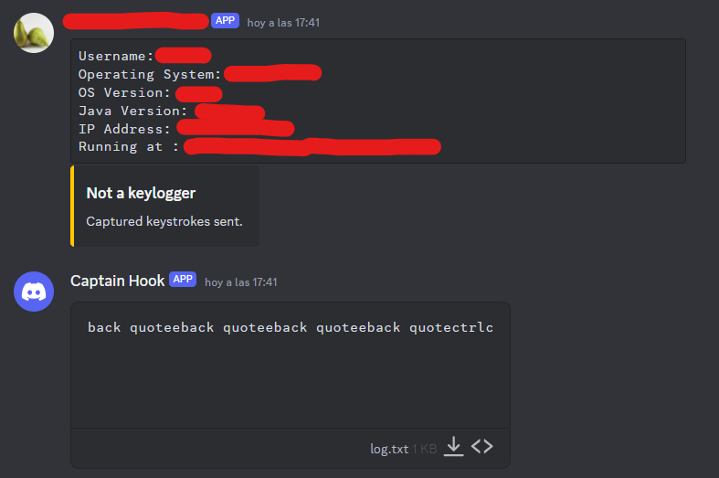

<p align="center">
  <a href="" rel="noopener">
 </a>
</p>

<h3 align="center">Java Keylogger</h3>

<div align="center">

[]()
[](https://github.com/pvtoari/java_keylogger/issues)
[](https://github.com/pvtoari/java_keylogger/pulls)
[](/LICENSE)

</div>

---

<p align="center"> Java-based keylogger with Discord's webhook system features
    <br> 
</p>

## 📝 Table of Contents

- [About](#about)
- [Getting Started](#getting_started)
- [Usage](#usage)
- [Built Using](#built_using)
- [Authors](#authors)
- [Acknowledgments](#acknowledgement)

## 🧐 About <a name = "about"></a>
This program, designed for educational purposes, provides insights into keyloggers' operations. Unauthorized use of keyloggers is illegal and unethical. This code is a learning tool, not for malicious use. Respect for privacy and legal and ethical standards is paramount.

Studying this keylogger can help developers understand keystroke logging, aiding in improving security measures and creating defenses. This knowledge should be used ethically to safeguard user privacy and system security.

## 🏁 Getting Started <a name = "getting_started"></a>

These instructions will get you a copy of the project up and running on your local machine for development and testing purposes. See [deployment](#deployment) for notes on how to deploy the project on a live system.

### Prerequisites

* Java 11 or greater.
* A not headless-mode system.
* Internet connection.

### Installing

Clone the repository and build it with Maven

```mvn clean install```

A JAR and EXE will be generated and ready to use, using the configuration available in ```Config.java```.

## 🎈 Usage <a name="usage"></a>

When the victim starts the executable, his keystrokes will start to be recorded and processed by the program. 

Keystrokes will be saved on a temporary file named "log.txt" and sent to a Discord channel.

Let's look at an example by using the Config class in the project:


You're able to set your private webhook URL, the profile picture and username used.

This parameters setted correctly will be reflected on the program working like this:



_Note: bad data at ```Config.java``` will result on the program not sending info to Discord._

No traces are left since the program also clears every possible generated file (WIP, it's supossed to :$).

## ⛏️ Built Using <a name = "built_using"></a>

- [JNativeHook](https://github.com/kwhat/jnativehook) - Listening to keyboard thanks to this library
- [Maven](https://maven.apache.org/) - Dependency management

## ✍️ Authors <a name = "authors"></a>

- [@pvtoari](https://github.com/pvtoari) - Main developer

See also the list of [contributors](https://github.com/pvtoari/java_keylogger/contributors) who participated in this project.

## 🎉 Acknowledgements <a name = "acknowledgement"></a>

I want to thank [k3kdude](https://gist.github.com/k3kdude/fba6f6b37594eae3d6f9475330733bdb) for providing a very good snippet that has allowed me to implement the webhook functionalities with Discord. 

Anyway I modified it a little bit to my convenience.